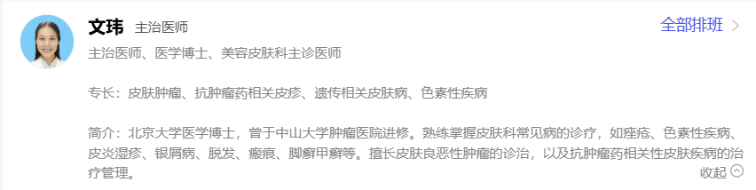
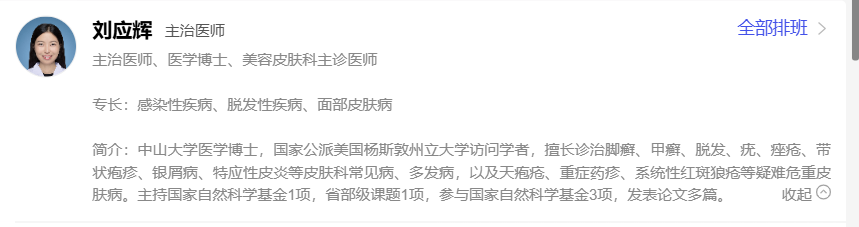

# 南方医科大学皮肤病医院
## 地址
广州市越秀区麓景路2号
## 交通
5号线小北C出口，步行460米

## 皮肤内科/专科门诊
#### 文玮 主治医师

- 资质：主治医师、医学博士、美容皮肤科主诊医师
- 专长：皮肤肿瘤、抗肿瘤药相关皮疹、遗传相关皮肤病、色素性疾病
- 简介：北京大学医学博士，曾于中山大学肿瘤医院进修。熟练掌握皮肤科常见病的诊疗，如痤疮、色素性疾病、皮炎湿疹、银屑病、脱发、瘢痕、脚癣甲癣等。擅长皮肤良恶性肿瘤的诊治，以及抗肿瘤药相关性皮肤疾病的治疗管理。

#### 刘应辉 主治医师

- 资质：主治医师、医学博士、美容皮肤科主诊医师
- 专长：感染性疾病、脱发性疾病、面部皮肤病
- 简介：中山大学医学博士，国家公派美国杨斯敦州立大学访问学者，擅长诊治脚癣、甲癣、脱发、疣、痤疮、带状疱疹、银屑病、特应性皮炎等皮肤科常见病、多发病，以及天疱疮、重症药疹、系统性红斑狼疮等疑难危重皮肤病。主持国家自然科学基金1项，省部级课题1项，参与国家自然科学基金3项，发表论文多篇。

---

### 二、灰指甲（甲癣）诊疗能力对比
灰指甲的医学名称为甲癣，是皮肤癣菌等真菌感染引发的甲病变，属于**感染性皮肤病**范畴。综合两位医生的信息判断：

1. **专长匹配度**
刘应辉的核心专长明确包含**感染性疾病**，与甲癣的疾病分类高度契合；文玮的核心专长集中在皮肤肿瘤、色素性疾病、遗传皮肤病方向，甲癣仅属于她掌握的普通常见病，并非核心研究/诊疗方向。

2. **疾病诊疗定位**
文玮对甲癣的表述是“熟练掌握”的常见病之一；刘应辉将脚癣、甲癣放在“擅长诊治”疾病列表的前列，对该类疾病的诊疗定位更高、经验更聚焦。

3. **复杂情况处理能力**
刘应辉同时具备疑难危重皮肤病的诊疗经验，且主持/参与过感染相关的国家级、省部级科研课题，对感染性皮肤病的病理、用药理解更深入，若灰指甲合并复杂感染、基础疾病等特殊情况，处理能力更有优势。

### 结论
**刘应辉医生更擅长灰指甲（甲癣）的治疗**。
